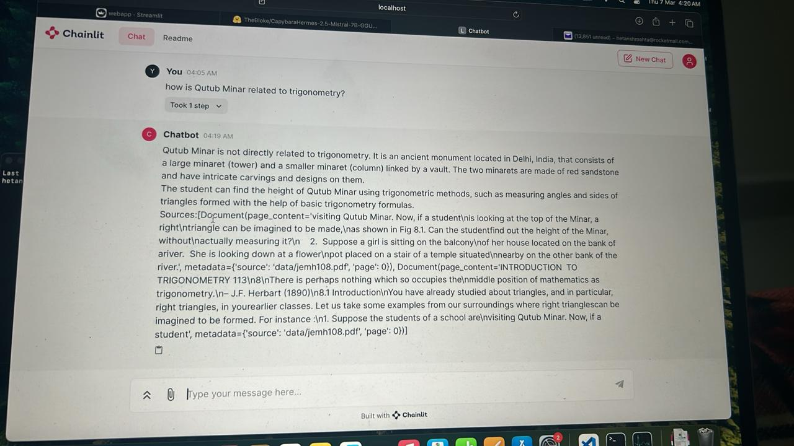

# Llama 2 with Chainlit, Locally hosted with CPU

## Steps to use : 
1) Install all the requirements 
2) Add your pdf file that you want to turn into a document store/knowledge base for the bot into the data folder
3) Run ingestion.py to make the vector database for the bot
4) Run the webapp using - chainlit run webapp.py
5) If chainlit is not recognised as a command, use pip to install it or use - python3 -m chainlit run webapp.py

## Sample Output : 

